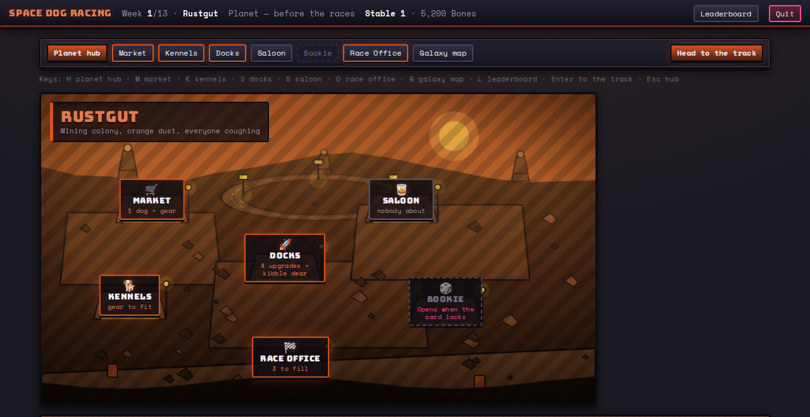

# Space Dog Racing

**[Play it → space-dog-racing.pages.dev](https://space-dog-racing.pages.dev)**

Thirteen weekends on the grimy underground greyhound circuit of a cartoon future. You run a
stable of space dogs — three that race, two in reserve — and every week the whole circuit jumps
to a new planet for three races: Bronze, Silver and Gold. Prize money is the main way to get
rich, but it is not the only one. There is a market for dogs on every rock, kibble to buy cheap
and sell dear, a ship whose hold and engine you can upgrade, staff to hire, a bookie who will
take a bet on your own dog or against a rival's, and a supplement the stewards would rather you
did not feed anybody. Thirteen weeks later, the richest stable at the Galactic Collar wins.
It owes an obvious debt to Gazillionaire, and it would like to smell like Death Rally.



Browser game, single player against Easy, Normal and Hard AI stables, or hotseat for up to eight
around one laptop. No install, no account, no server: a season is a seed plus your action log,
kept in your own browser. Online multiplayer is M5.

## What is in this build

Milestone M4 — the whole game. Every venue works, the races are watchable, the AI plays three
distinguishable levels of well, and the season ends on a podium, a net-worth chart and the story
of how it was won.

**The art is mostly not real yet.** 11 of the 149 files in the library are finished; the other
138 are generated stand-ins — hatched slots labelled "placeholder", or an emoji where an icon
will go. `npm run asset-check` will tell you exactly which is which at any moment. The kit, the
layout and the colour are real; the pictures are coming.

Share a season with `?seed=12345&players=h,normal,normal,hard` — that link fills the New Season
screen in with the same seed and the same table, so two people can play the same thirteen weeks
and compare. `h` is a human, the AI difficulties are spelled out, and `&toggles=nobet` and
friends carry the complexity switches, because a seed only replays the same way with the same
toggles.

## The design

`design/GDD.md` is the source of truth for the rules and `design/BUILD_PLAN.md` for the roadmap.
`design/space_dog_racing_economy.xlsx` is the source of truth for the numbers — `balance.json` is
generated from it and never hand-edited. `design/PLAYTEST_NOTES.md` is what happened when a
person actually played it, which is the only document here that can prove any of the others
wrong.

## Developing

```
npm install
npm test                          # typecheck + engine tests (golden seed, invariants, race calibration)
npm run lint
npm run dev                       # Vite dev server for packages/web
npm run build                     # builds packages/web/dist (what Cloudflare Pages deploys)

npm run harness -- --seasons 200  # balance instrument: end worth, win rates, income split …
npm run harness -- --seasons 800 --ai easy,normal,normal,hard,hard,normal   # head-to-head by difficulty
npm run harness -- --calibrate    # race-sim win rates vs rating gap, bookie model fit
npm run balance                   # regenerate packages/engine/src/content/balance.json from the spreadsheet

npm run asset-check               # every art file against its spec and byte cap, and what the site weighs
npm run asset-list                # regenerate design/ASSET_LIST.md, the art contract
npm run placeholders              # redraw the stand-in art for anything still missing

npm run snapshot                  # dated local backup into backups/
```

Three more checks are not part of `npm test` and are worth running before a milestone. They drive
the real UI functions headlessly — `store/loop.ts` and `screenFor`, the same two the app walks —
so a whole season can be played, and counted, without a browser:

```
npx tsx packages/web/scripts/season-check.ts     # five seeds and the toggle variant, to week 13
npx tsx packages/web/scripts/race-view-check.ts  # every race replays the finish the engine recorded
npx tsx packages/web/scripts/hub-clicks.ts 20    # what a weekend costs in clicks
```

### Rules of the codebase

`CLAUDE.md` has the full list; the short version is that `packages/engine` is pure — no DOM, no
`Date`, no `Math.random`, no implementation-defined maths — so the same seed and the same action
log reproduce the same season on any machine and any JS engine. Every state change is an Action.
Content is data, not code: a new planet is a row plus its images, never a branch.
