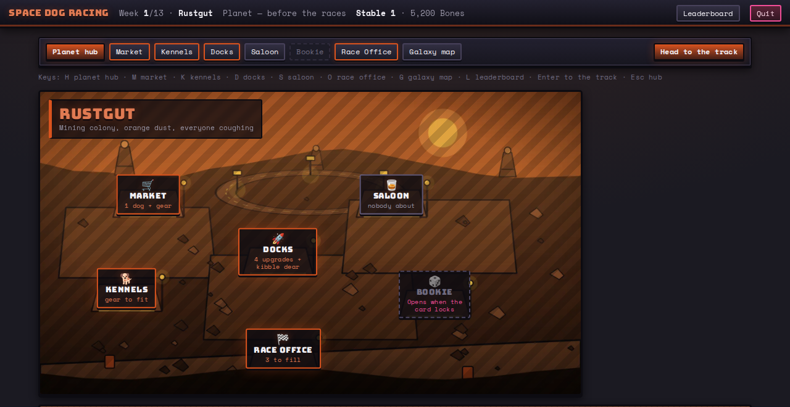

# Space Dog Racing

**[Play it → space-dog-racing.pages.dev](https://space-dog-racing.pages.dev)**

Play online with friends: press **Play online**.

Ten weekends a season on the grimy underground greyhound circuit of a cartoon future. You run a
kennel of four space dogs and two trainers, and every week the circuit jumps to a new planet for
three races: Bronze, Silver and Gold. Prize money is the main way to get rich, but not the only
one: there is a door to open on every rock (dogs, tips, money, trouble), six foods to buy cheap and
sell dear that are also your dogs' training, and a bookie who will take a bet on your own dog or a
rival's. Richest stable at the end wins. It owes an obvious debt to Gazillionaire, and it would like
to smell like Death Rally.



Browser game: solo against Easy, Normal and Hard AI stables, hotseat for up to eight around one
laptop, or online with a browser each. No install, no account: a game is a seed plus the action log.

## What is in this build

v3, the party game (`design/GDD_V3.md`). Press **Play** on the Title for a solo season against five
AI stables; **Custom game** under it sets up a hotseat table of up to eight (any mix of humans and
Easy, Normal and Hard AIs), one to five seasons or a race to a target, and the toggles; **Play
online** (on the live site) makes a room for friends in other houses. A game opens on a draft of four
dogs and two trainers. A weekend is a door to open, the six-food market that is also your dogs'
training, a dog in each of three races, a bet, and the races. Every planet is painted.

Share a game with `?seed=12345&players=h,normal,normal,hard` — the link opens the Custom game with
the same seed and the same table, so two people can play the same season and compare. `h` is a
human, the AI difficulties are spelled out, and `&toggles=nobet` and friends carry the switches,
because a seed only replays the same way with the same toggles.

## The design

`design/GDD.md` is the source of truth for the rules and `design/BUILD_PLAN.md` for the roadmap.
`design/space_dog_racing_economy.xlsx` is the source of truth for the numbers — `balance.json` is
generated from it and never hand-edited. `design/PLAYTEST_NOTES.md` is what happened when a
person actually played it, which is the only document here that can prove any of the others
wrong.

## Developing

```
npm install
npm test                          # typecheck + engine tests (golden seed, invariants, race calibration)
npm run lint
npm run dev                       # Vite dev server for packages/web
npm run build                     # builds packages/web/dist (what Cloudflare Pages deploys)

npm run harness -- --seasons 200  # balance instrument: end worth, win rates, income split …
npm run harness -- --seasons 800 --ai easy,normal,normal,hard,hard,normal   # head-to-head by difficulty
npm run harness -- --calibrate    # race-sim win rates vs rating gap, bookie model fit
npm run balance                   # regenerate packages/engine/src/content/balance.json from the spreadsheet

npm run asset-check               # every art file against its spec and byte cap, and what the site weighs
npm run asset-list                # regenerate design/ASSET_LIST.md, the art contract
npm run placeholders              # redraw the stand-in art for anything still missing

npm run snapshot                  # dated local backup into backups/
```

Three more checks are not part of `npm test` and are worth running before a milestone. They drive
the real UI functions headlessly — `store/loop.ts` and `screenFor`, the same two the app walks —
so a whole season can be played, and counted, without a browser:

```
npx tsx packages/web/scripts/season-check.ts     # five seeds and the toggle variant, to week 13
npx tsx packages/web/scripts/race-view-check.ts  # every race replays the finish the engine recorded
npx tsx packages/web/scripts/hub-clicks.ts 20    # what a weekend costs in clicks
```

### Rules of the codebase

`CLAUDE.md` has the full list; the short version is that `packages/engine` is pure — no DOM, no
`Date`, no `Math.random`, no implementation-defined maths — so the same seed and the same action
log reproduce the same season on any machine and any JS engine. Every state change is an Action.
Content is data, not code: a new planet is a row plus its images, never a branch.
